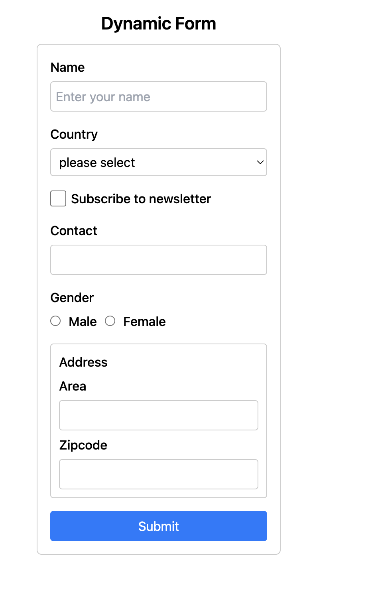

# Dynamic Form

## Overview

You are provided with a **Dynamic Form** that can render various types of form fields (text, select, checkbox, number, radio) based on a given schema. The form supports features like custom validation, nested fields, and handles form data changes through callbacks.

### Your Task

Most of the code is already implemented. Your task is to:

1. **Implement Missing Features:** Add any necessary features that are currently missing.
2. **Fix Broken Functionality:** Identify and correct any bugs in the existing code.
3. **Ensure Accessibility:** Make sure the form is accessible and follows best practices.

### Example Schema and Usage:

```javascript
const formSchema = [
  {
    type: 'text',
    name: 'name',
    label: 'Name',
    placeholder: 'Enter your name',
    required: true,
  },
  {
    type: 'select',
    name: 'country',
    label: 'Country',
    placeholder: 'please select',
    options: [
      { value: 'us', label: 'United States' },
      { value: 'ca', label: 'Canada' },
    ],
  },
  {
    type: 'checkbox',
    name: 'subscribe',
    label: 'Subscribe to newsletter',
  },
  { type: 'number', name: 'contact', label: 'Contact' },
  {
    type: 'radio',
    name: 'gender',
    label: 'Gender',
    disabled: true,
    options: [
      { value: 'male', label: 'Male' },
      { value: 'female', label: 'Female' },
    ],
  },
  {
    type: 'object',
    label: 'Address',
    name: 'address',
    fields: [
      {
        type: 'text',
        name: 'area',
        label: 'Area',
      },
      {
        type: 'number',
        name: 'zipcode',
        label: 'Zipcode',
      },
    ],
  },
];
```



### Test Cases

- **dropdown should display correct labels:**

  - Ensure that select fields render with the correct options and display the appropriate labels. Currently, the dropdown is showing the value instead of the label, so this needs to be corrected. Below is an example of the select field schema::

  ```javascript
  {
    type: 'select',
    name: 'country',
    label: 'Country',
    placeholder: 'please select',
    options: [
      { value: 'us', label: 'United States' },
      { value: 'ca', label: 'Canada' },
    ],
  }
  ```

- **Handles Nested Field Structures Correctly:**

  - Ensure that nested fields are managed properly and that their data is correctly nested within the form data object. The schema might include a structure like this:

  ```javascript
  const formSchema = [
    {
      type: 'text',
      name: 'name',
      label: 'Name',
      placeholder: 'Enter your name',
      required: true,
    },
    {
      type: 'object',
      label: 'Address',
      name: 'address',
      fields: [
        {
          type: 'text',
          name: 'area',
          label: 'Area',
        },
        {
          type: 'number',
          name: 'zipcode',
          label: 'Zipcode',
        },
      ],
    },
  ];
  ```

  - Verify that the nested structure in the form data matches the expected format. For example:

  ```javascript
  const expectedFormData = {
    name: 'John Doe',
    address: {
      area: 'Springfield',
      zipcode: 23513,
    },
  };
  ```

- **Handle Form Submission Validation**

  - **Objective**: Ensure that the form validation is handled during submission based on the `validate` function provided in the schema.
  - **Details**:
    - The `validate` function will be included in the schema for specific fields.
    - On form submission, validate the form data against the schema.
    - Display "Form Submitted Successfully!" if validation passes, otherwise display "Form Validation Failed."
    - Implement a recursive `validateForm` function to handle nested fields.

```javascript
const formSchema = [
  {
    type: 'text',
    name: 'name',
    label: 'Name',
    placeholder: 'Enter your name',
    required: true,
  },
  {
    type: 'text',
    name: 'email',
    label: 'Email',
    placeholder: 'Enter your Email',
    required: true,
    validate: (value) => /^[^\s@]+@[^\s@]+\.[^\s@]+$/.test(value), // Email should match regex
  },
];
```

In this schema, ensure that the `email` field's value is validated against the specified regex pattern. If the value matches the pattern, the form validation is considered successful. If not, validation fails. Implement a recursive `validateForm` function to support validation of nested fields.
